# The Social-Engineer Toolkit (SET)

## Introduction

Selon la propre description donnée par [TrustedSec, LLC](https://www.trustedsec.com), la société de consulting américaine responsable du développement de ce produit, le [Social-Engineer Toolkit](https://github.com/trustedsec/social-engineer-toolkit/) est un framework de test d'intrusion open-source conçu pour l'ingénierie sociale. Le SET dispose d'un certain nombre de vecteurs d'attaque personnalisés qui vous permettent de réaliser rapidement une attaque crédible.

Le SET est spécifiquement conçu pour réaliser des attaques avancées contre l'élément humain. Il est rapidement devenu un outil standard dans l'arsenal des testeurs de pénétration. Les attaques intégrées dans la boîte à outils sont conçues pour être des attaques ciblées contre une personne ou une organisation utilisées lors d'un test de pénétration.


## Téléchargement et installation

Le SET est nativement supporté sur Linux et sur Mac OS X (experimental). Il est préinstallé sur Kali Linux et il est capable de se mettre à jour lui-même.

Pour une installation sur Ubuntu/Debian/Mac OS X :

```
git clone https://github.com/trustedsec/social-engineer-toolkit/ setoolkit/
cd setoolkit
pip3 install -r requirements.txt
python setup.py
```

## Que faut-il faire ?

Vous devez installer le Social Engineering Toolkit (SET), créer un collecteur d'identifiants (credential harvester), capturer certains identifiants utilisateur (les vôtres), créer une attaque de phishing, relier le collecteur d'identifiants à l'attaque. Pour chaque tâche, faites des captures d'écran de vos activités.

## Note sur l'éthique

Il n'est absolument pas acceptable d'attaquer quelqu'un pour quelque raison que ce soit. 

L'utilisation de cet outil à des fins autres que votre propre éducation et formation sans autorisation est strictement interdite par les politiques de ce cours et de l'école, ainsi que par les lois. 

Le but de cet exercice est de vous permettre de vous familiariser avec les outils et comment ils peuvent être utilisés dans le context professionnel d'un pentest. Ça vous permettra aussi de comprendre les tactiques de l'adversaire afin de pouvoir les contrer par le biais de la politique, de l'éducation et de la formation.

## Execution de SET

Pour executer SET, dans votre terminal tapper :

```
setoolkit
```

Dépendant de votre OS et de votre installation particulière, il est possible que certaines fonctionnalités ne soient pas disponibles au moins d'utiliser ```sudo```.

```
sudo setoolkit
```

# Exercice 1 - Credential Harvesting

Vous découvrirez l'un des outils les plus couramment utilisés par les ingénieurs sociaux et les acteurs malveillants pour tromper les cibles.

### Soumettre des captures d'écran

Pour le collecteur d'identifiants, montrez que vous avez cloné un site en indiquant son adresse web et l'interface d'utilisateur. Saisissez les informations d'identification sur votre clone local, puis cliquez le bouton de connexion. Essayez plusieurs sites comme facebook.com, twitter.com, et d'autres qui puissent vous intéresser. Faites des captures d'écran des mots de passe collectés dans vos tests avec SET.

J'ai testé avec le site facebook : 

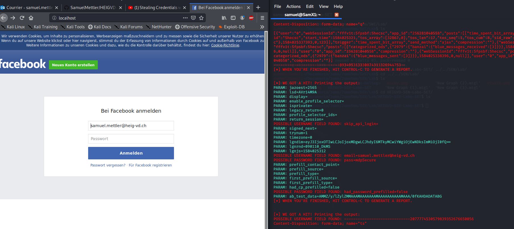

On peut voir sur le coté l'email et le mot de passe entré.

# Exercice 2 - Créer une attaque de phishing

Essayez la fonction d'attaque par phishing. C'est très facile à faire. Vous pouvez vous référer à ce lien pour plus d'informations http://www.computerweekly.com/tutorial/Social-Engineer-Toolkit-SET-tutorial-for-penetration-testers

Voici l'email que je me suis envoyé : 

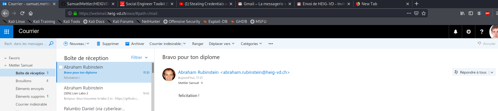

# Exercice 3 - Explorer les liens "Phishy" et le courrier électronique "Phishy"

Pour cette dernière partie de notre exploration du phishing, nous allons utiliser un contenu réalisé par les  Dr. Matthew L. Hale, le Dr. Robin Gandhi et la Dr. Briana B. Morrison de [Nebraska GenCyber](
http://www.nebraskagencyber.com). 

Visitez : https://mlhale.github.io/nebraska-gencyber-modules/phishing/README/ et passez en revue les modules 

- Analyse d'url (ce module peut être intéressant pour vos rapports de pentest, comme outil pour sensibiliser les employés d'une entreprise, mais il risque d'être trop simple pour vous)
- Analyse d'Email (me module est probablement plus intéressant techniquement pour vous)

En général, c'est un bon exemple de matériel de formation et d'éducation qui peut aider à lutter contre les attaques de phishing et à sensibiliser le personnel d'une organisation.

Vous avez la liberté de reproduire et d'utiliser le matériel grace à sa licence.


### Soumettre des captures d'écran

Pour cette tâche, prenez des captures d'écran de :

- Vos inspections de chaque lien dans votre navigateur

Lien 1 : redirige vers www.google.com comme peut l'afficher google chrome (en bas à gauche)

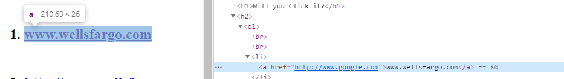

Lien 2 : même chose que le lien 1, on peut voir au survolage que le lien écrit et le lien réel n'est pas le même, il y a '%shy' en plus qui est quelques choses que le navigateur n'affiche pas.

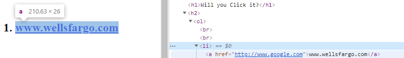

Lien 3 : cette fois on affiche pas le vrai lien mais on affiche une phrase à la place, il faut encore une fois regarder la pop up chrome pour savoir où on se rend avant de cliquer.

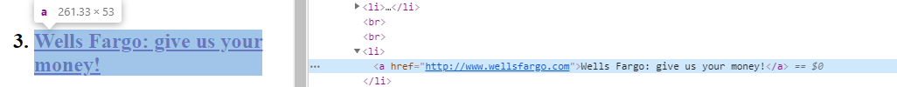

Lien 4 : on peut reconnaitre dans le lien la forme login:password@website. Certain site permet de se loger de cette manière mais pas tous.

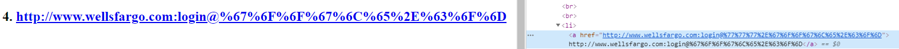

Lien 5 : Cette fois on utilise des URL shortener qui permettent de "racourcir" une URL comme leur nom l'indique. Cela peut empêche d'utiliser la prévisualisation de chrome car on a pas l'affichage de la destination.

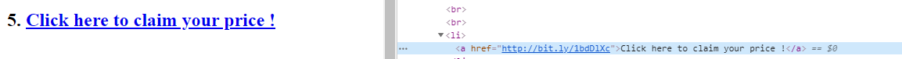

Lien 6 : Même chose que le lien 5 sauf que cette fois on observe que le lien réel (affiché par chrome en bas) est différent ! Il faut donc faire attention même en utilisant des outils permettant de savoir quel est la cible du short link

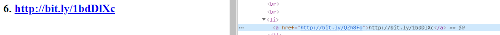

Lien 7 : Ce lien est un peu embêtant car on a même pas besoin de cliquer dessus pour s'y rendre. Il suffit de passer la souris dessus pour se rendre sur le site cible ! Attention donc à bien penser a désactiver javascript sur des pages suspectes.

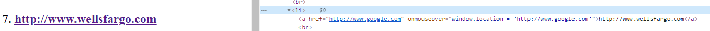

Lien 8 : A prioris en inspectant la source rien ne semble louche. En cliquant on s'apercoit qu'on est envoyé vers `http://xn--thn-5cdop7dtb.xn--m-0tbi/` qui n'a a prioris rien n'a voir. Il s'agit en faite de caractère russe utilisé. 

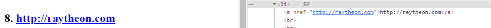

Lien 9 et 10 : On peut voir que ces liens (après s'être rendu sur la page) sont des `renders` du contenu de l'URL dans une page HTML : c'est à dire que le contenu de l'URL est interprété est mise en forme dans le navigateur. 

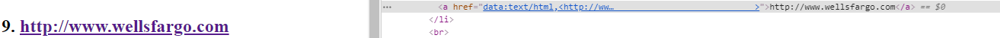

Lien 11 : On essaie de piéger l'utilisateur en pensant envoyer vers `yahoo.com` (titre du lien) alors qu'on redirige vers `google.com`

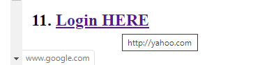


- Vos inspections d'un en-tête de courrier électronique à partir de votre propre boîte de réception

J'ai décidé de comparer 2 entêtes d'email : un légitime vs un que j'ai envoyé moi avec le toolkit :
Toolkit : 
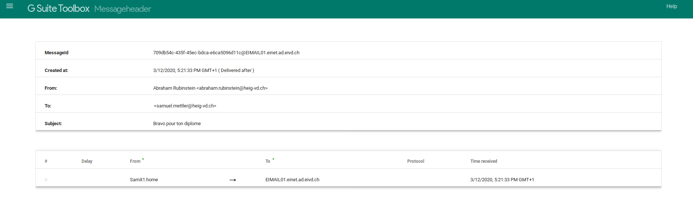

Légitime :
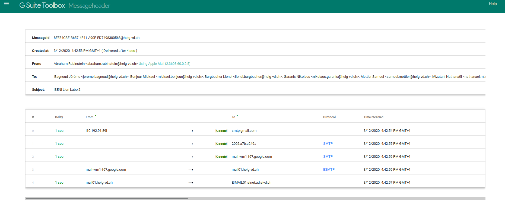

On peut voir que l'email légitime a beaucoup plus d'étape que celui qu'on a forgé nous crée nous même ! 